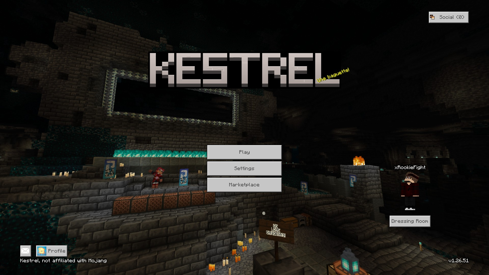
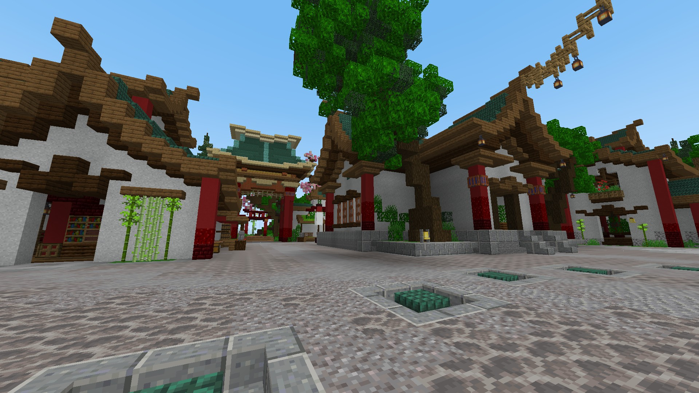
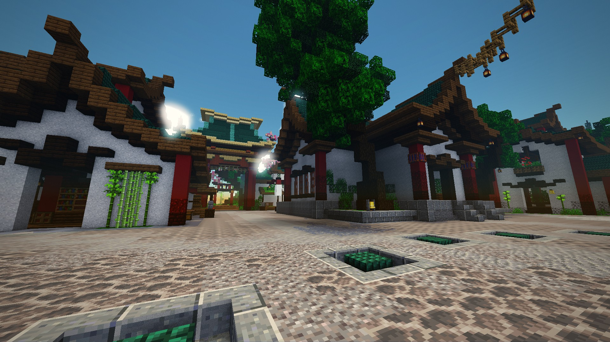
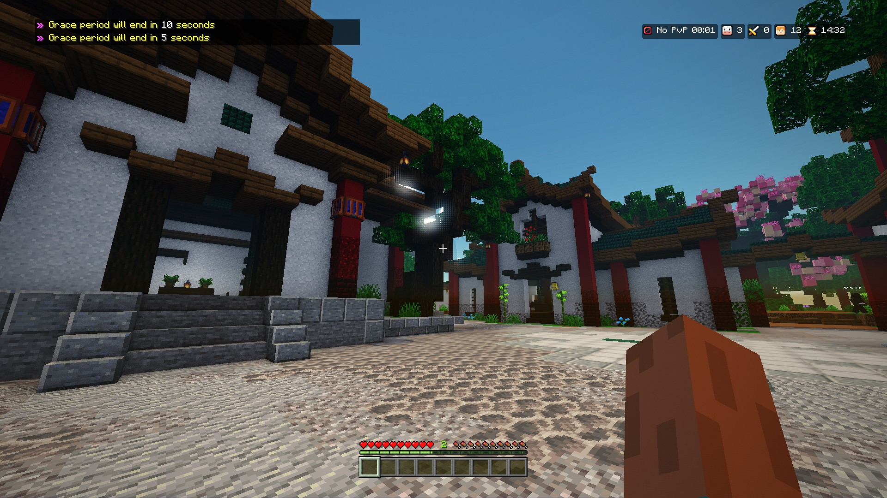
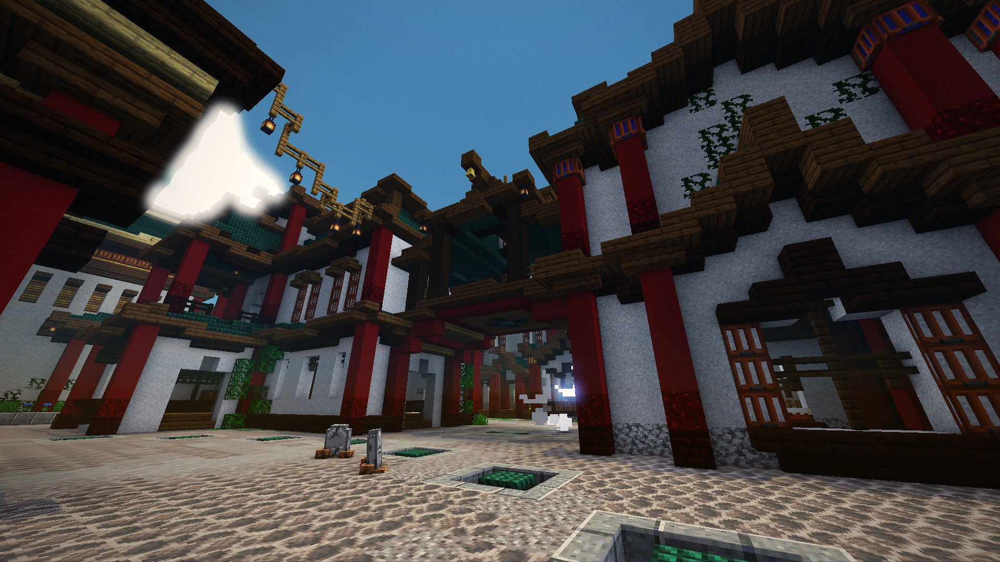

<p align="center">
	<picture>
		<source media="(prefers-color-scheme: dark)" srcset="https://raw.githubusercontent.com/Falcon-MC/Falcon/main/.github/logo-white.png">
		
	</picture>
	<br>
	<b>Kestrel</b>
	<br>
	Minecraft: Bedrock Edition client written in C++20
</p>

<p align="center">
	
	
	
	
	<br>
	<a href="https://github.com/Falcon-MC/Kestrel/actions/workflows/ci.yml"></a>
	<a href="https://github.com/Falcon-MC/Kestrel/releases/latest"></a>
	<a href="LICENSE"></a>
</p>

<p align="center">
	
</p>

## What is this?

Kestrel is a native Minecraft: Bedrock Edition client. It connects to servers and Realms with a Microsoft
account and renders the world with the textures of the installed game.

<table>
	<tr>
		<td></td>
		<td></td>
	</tr>
	<tr>
		<td align="center">Survival Games on The Hive</td>
		<td align="center">The same view with the ShaderX post processing mod</td>
	</tr>
</table>

<table>
	<tr>
		<td></td>
		<td></td>
	</tr>
	<tr>
		<td align="center">In game, with the HUD, chat and the server's sidebar</td>
		<td align="center">A courtyard on the same map</td>
	</tr>
</table>

- **Rendering** - Direct3D 12 on Windows, Metal on macOS, Vulkan on Linux
- **World** - chunk streaming, multithreaded greedy meshing, block models, animated textures and
  translucent blocks
- **Atmosphere** - day and night cycle, sun, moon, fog and clouds
- **Account** - Microsoft sign-in with a device code, Xbox profile and Realms list
- **Chat** - the game's chat screen and fading HUD log, commands, and server messages in the chosen language
- **HUD messages** - titles, popups, tips, the action bar and server toasts, timed and placed like the game's HUD
- **Discord** - shows Minecraft activity while Kestrel is open, reconnecting if Discord starts later
- **JSON UI** - the HUD and server forms drawn from the game's hud_screen.json and server_form.json, restyled
  by whatever UI the server's packs ship
- **Server packs** - the packs' UI files, textures and glyph sheets

## Downloads

Builds for Windows, Linux and macOS are on the [releases page](https://github.com/Falcon-MC/Kestrel/releases).
Versions read as `1.0.1+1.26.50`: Kestrel's own version first, then the Bedrock version it plays. A hotfix only
bumps the first part, a release for a new game version bumps both, like `1.0.2+1.26.60`.
A [nightly](https://github.com/Falcon-MC/Kestrel/releases/tag/nightly) is built from `main` every night when
something changed. Kestrel reads its textures from an installed copy of Minecraft: Bedrock Edition, or from a
vanilla resource pack you are entitled to use.

## Building

Requires CMake 3.24+, a C++20 compiler and zlib. Linux also needs the Vulkan SDK and `glslc`; Vulkan shaders
are generated from the GLSL sources during the build. The first configure
needs network access to fetch the dependencies.

```
cmake -B build -G Ninja
cmake --build build
```

On Windows, install [MSYS2](https://www.msys2.org) with the UCRT64 toolchain (g++, cmake, ninja) and add it to
`PATH`, then run `build.bat`. On Linux and macOS, `build.sh` does the same. Both write the build log to `build.txt`.

When `Falcon-NBT`, `Falcon-Protocol`, `Falcon-Network`, `Falcon-BedrockData` and `Falcon-BlockStateUpdater` sit
next to this directory they are used directly, otherwise they are fetched from GitHub. Set `KESTREL_FALCON_ROOT` to
point at another directory.

The block textures are read from the installed game. Set `KESTREL_VANILLA_PACK` to use another copy of the vanilla
resource pack you are entitled to use.

### iOS IPA

On macOS with Xcode and the iOS SDK installed, run `./build-ios.sh` to build
`build/ios/Kestrel.ipa` for iOS 16.3 or later. This is an unsigned arm64 app;
it can be imported into PlayCover without a developer signing identity.

On first launch, iOS downloads the full resource pack from Mojang's
`bedrock-samples` v1.26.50.4 release and caches it in the app's data directory.
Later launches work without downloading it again. Mojang's repository omits
the fonts, so the build bundles the bitmap fonts and HTML menu assets from
the installed game. Set `KESTREL_IOS_RESOURCE_PACKS` to its `resource_packs`
directory containing `vanilla`; the script defaults to BedrockOnMac.
`KESTREL_IOS_CA_BUNDLE` selects the TLS certificate authority
bundle and defaults to `/etc/ssl/cert.pem` on the build Mac. OpenSSL is fetched
and built by CMake with the other dependencies.

The iOS build uses UIKit, Metal, native audio, and hardware keyboards, mice,
and gamepads. Touch supports menus, the software keyboard, simultaneous movement
and looking, action buttons, and hotbar selection. The JSON UI Touch tab saves
the control scheme, sensitivity, handedness, joystick visibility, sneak behavior,
and control size/opacity. Gameplay controls use `data/ui/touch_controls.json`
with Mojang's icons. Importing skins and resource packs uses the system's
document picker. Installing on an iPhone or iPad requires signing the IPA
through your chosen installation tool.

### Android APK

With the Android SDK, NDK, CMake 3.31.6 and Gradle installed, run
`./build-android.sh` on Linux or macOS to build an arm64 APK for Android 8.0 or
later with Vulkan 1.1. Like on iOS, the app downloads Mojang's
`bedrock-samples` pack on first launch. Set `KESTREL_ANDROID_RESOURCE_PACKS` to
an installed game's `resource_packs` directory to also ship its fonts and HTML
menu assets, or `KESTREL_ANDROID_NO_GAME_FILES=1` to build without them, as CI
does: text is then drawn with Monocraft and Noto Sans (OFL-1.1), which the
script downloads and checks against `data/fallback_fonts.txt`. It fetches SDL,
which provides the window, input and file picker, and packages
`android/app/build/outputs/apk/release/app-release.apk` signed with the debug
key.

## Command line and agents

```
Kestrel --connect play.example.net:19132   join a server straight away, skipping the start screen
Kestrel --hidden --agent                   no visible window, frames drawn offscreen
Kestrel --headless --connect <address>     no window and no rendering, chat printed to stdout
```

`--agent` (or `--agent-port <port>`) opens a JSON control port on 127.0.0.1 for automation. The port and its
token are written to `agent.json` in the data directory; set `KESTREL_AGENT_TOKEN` to choose the token. The
[kestrel-mcp](https://github.com/Falcon-MC/kestrel-mcp) server uses it to let AI agents drive Kestrel: screenshots,
menus, input, forms, inventory and packet logs.

## Mods

Kestrel loads native C++ mods from the `mods` folder in the data directory. Every library in there is loaded
and enabled at start; removing it turns the mod off. A mod is a class derived from `kestrel::mod::Mod` plus a
`KESTREL_MOD(ClassName)` line, built as a shared library with `cmake/KestrelMod.cmake`:

```cpp
#include "mod/Api.h"

using namespace kestrel::mod;

class Greeter : public Mod {
public:
    Greeter() : Mod({ .id = "greeter", .name = "Greeter", .version = "1.0.0" }) { }

    void onEnable() override
    {
        command("hi", "Says hi", [](CommandContext& context) { context.reply("Hi!"); });
        on<JoinEvent>([this](JoinEvent& event) { chat().print("Welcome to " + event.server); });
    }
};

KESTREL_MOD(Greeter)
```

Mods get events (chat, titles, forms, keys, movement, packets, HUD and world drawing), client side `.commands`,
key bindings, a scheduler, per mod settings, packet filters and custom shaders. See
[examples/mods](examples/mods) for the details and working mods.

API 4 adds block collision and properties, break times and block searches by property; the player's tick
position, velocity, bounding box and state; breaking, using items, inventory moves and containers; block,
chunk, entity, inventory, player tick and break progress events; elytra and flight requests in
`MovementEvent`; line, box and 3D text drawing; HUD projection and notifications; worker threads through
`Scheduler::async`; generated settings pages; typed packets; command completion; and services shared between
mods.

Mods built for API 1 to 3 still load unchanged: new members are appended after the existing ones. A mod that
needs another declares it in `Mod::dependencies()`.

## Contributing

Pull requests are welcome. Read [CONTRIBUTING.md](CONTRIBUTING.md) first, and follow the
[Code of Conduct](CODE_OF_CONDUCT.md). Security issues go through [SECURITY.md](SECURITY.md), never a public issue.

## Related repositories

- [Protocol](https://github.com/Falcon-MC/Protocol) - packets and network types
- [Network](https://github.com/Falcon-MC/Network) - RakNet and NetherNet transport
- [NBT](https://github.com/Falcon-MC/NBT) - NBT tags and binary streams
- [BedrockData](https://github.com/Falcon-MC/BedrockData) - game data files, versioned by protocol
- [BlockStateUpdater](https://github.com/Falcon-MC/BlockStateUpdater) - upgrades old block states to the current version

## Licensing information

Kestrel is licensed under the [GNU Lesser General Public License v3.0](LICENSE), which supplements
the [GNU General Public License v3.0](COPYING).

Kestrel ships no game assets. Textures, UI files and fonts are read from a Minecraft installation you own, or from
a vanilla resource pack you are entitled to use.

Signing in goes through the same Xbox Live and PlayFab services the game itself talks to. Using an unofficial
client with them is at your own risk.

NOT AN OFFICIAL MINECRAFT PRODUCT. NOT APPROVED BY OR ASSOCIATED WITH MOJANG OR MICROSOFT.
All brands and trademarks belong to their respective owners.
